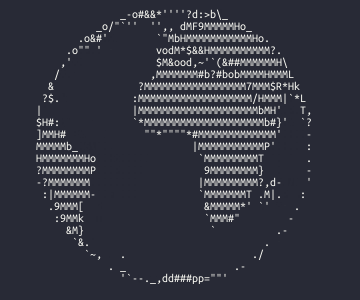

# Description
Toy project. Primitive escape sequences interpreter of VT100 terminal (second layer, because bash also interpret
escape sequences generated by [termion](https://github.com/redox-os/termion)), that add delays and clear screen
between [globe](http://artscene.textfiles.com/vt100/globe.vt) animation frames.

# References
- http://artscene.textfiles.com/vt100/
- https://dotink.co/posts/ansi/
- https://pl.wikipedia.org/wiki/ASCII#Tabela_kod%C3%B3w_ASCII
- https://en.wikipedia.org/wiki/ANSI_escape_code#CSI_(Control_Sequence_Introducer)_sequences
